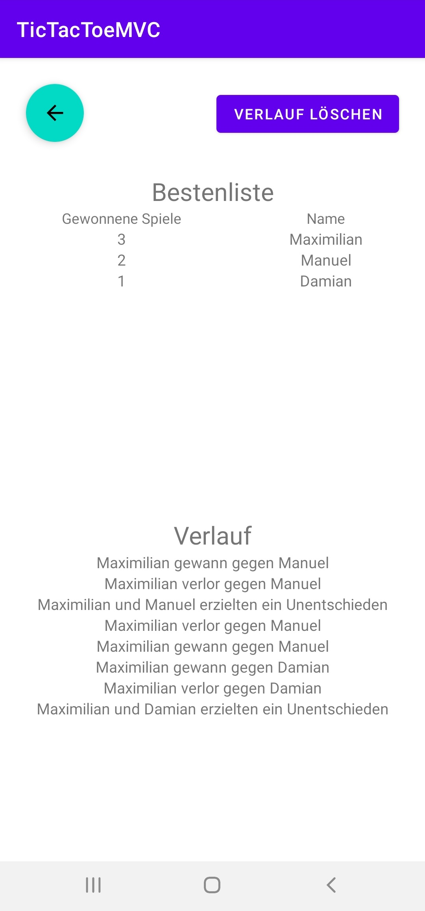

# Tic-Tac-Toe
This implementation of the simple, yet popular game Tic-Tac-Toe is written in Kotlin to get more familiar with the Model-View-Controller-Pattern (MVC).

## Approach
The playing board is modeled using a parent linear vertical layout. This layout contains five rows, each consisting of one or five ImageViews. The first, third and fifth row each consist of three square imageViews representing a single field each and two ImageViews with vertical black bars who are positioned between them as horizontal dividers and to hint the playing field. The second and fourth row consist of only a single wide ImageView with a horizontal black bar. This bar serves as a vertical divider between the fields. Because none of the ImageViews containing black bars have a border or anything similar, it seems as if the whole grid is a single image, while in reality it is made of eight ImageViews in total.

In code the board is represented as a one-dimensional array, which is done by first putting all ressource ids into an array and performing a lookup for each:
```Kotlin
val fieldIds = arrayOf(R.id.img_0, R.id.img_1, R.id.img_2, R.id.img_3,
				R.id.img_4, R.id.img_5, R.id.img_6, R.id.img_7, R.id.img_8)
val fields = Array(9) { i -> rootView.findViewById<ImageView>(fieldIds[i]) }
```
Trough this individual fields can be accessed by their index, which starts at the top left and counts first horizontally and then vertically:  


The game has to know when one player has made a winning move or the space to place marks has run out and thus the game has to be declared a draw. The draw is very simple to detect: As long neither player has won yet and there is at least one field that isn't empty, the game can't be a draw.  
But checking if someone has won is slighty more difficult and can be done in several ways. The way I did it was to first create a loop which loops from zero to two and performs two checks each turn. The first one is checks whether the current row is a win and the second one does the same thing for the current column:
```Kotlin
for(i in 0..2) {
    if(board[i * 3] != State.NONE && board[i * 3] == board[i * 3 + 1] && board[i * 3] == board[i * 3 + 2]) {
        setWinner(board[i * 3])
        return
    }
    if(board[i] != State.NONE && board[i] == board[i + 3] && board[i] == board[i + 6]) {
        setWinner(board[i])
        return
    }
}
```

Now all there is left to do is to check the diagonals, which is as simple as it sounds - Just check whether all fields in either of the two diagonals are equal:
```Kotlin
if(board[4] != State.NONE) {
    if(board[0] == board[4] && board[0] == board[8]
    || board[2] == board[4] && board[4] == board[6]) {
        setWinner(board[4])
        return
    }
}
```

## Functionalities
- The game prevents players from taking illegal turns
- Current turn is displayed during play
- On a win by either player or a draw the board state is still visible and the UI displays who (if anyone) has won until the reset-button is pressed.
- Players can change their names
- Match history is recorded in a history
- It is also possible to view how often each player won in the leaderboard
- History is preserved between app-usages
- The history can be cleared

## Screenshots
When you first open the appp (and after pressing the reset-button) the app will look like this:  
  

During a match the app might look like this:  
  

Eventually, one player wins or a draw is achieved:  
  

Before playing any matches (or after clearing the history) the history screen will look like this:  
  

And after a few matches have been played it might look like this:  
  
